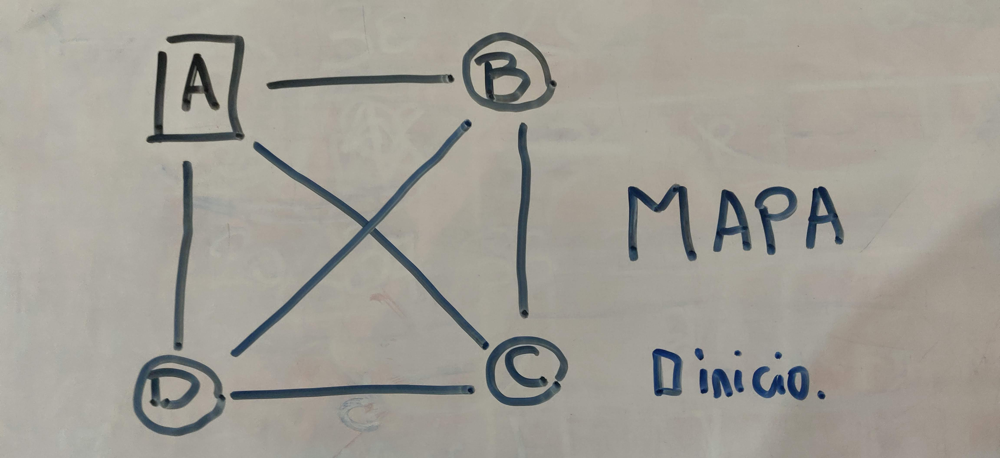

# Trabajo Final de Estructuras de Datos y Algoritmos

```c
typedef struct _MatrizCostos {
  int* matriz;
  int n;
  int* visitados;
} * MatrizCostos;
```
- Primero utilizo un solo arrlego de n*n, donde n es la cantidad de ciudades, para disminuir el llamado de la funcion ```calloc()```. Luego para poder acceder a la posicion ```[i][j]``` de la matriz utilizamos la ecuacion ```[(n * i) + j]```.
Decidi utilizar una matriz simetrica para hacer la busqueda dentro de la matriz mas rapida, ya sabiendo que ocupa mas memoria que una matriz triangular superior.
- n representa la cantidad de ciudades
- Por ultimo, utilizo un arreglo de n enteros, que usamos al momento de de buscar el camino de menor costo. Este arreglo es de 0 y 1. Si queremos ver si visitamos la ciudad k, usamos ```visitados[i]``` y si es 1, es que fue visitado, y 0 en el caso contrario.

### Resolucion de Problema
Decidi resolver este problema usando fuerza bruta, con algunas optimizaciones.
La primera optimizacion fue fijar un orden al camino. Como podemos ver en la funcion ```resolver_mapa()```, lo que hago es fijar la primera ciudad que voy a visitar y tambien fijo la ultima ciudad que voy a visitar, realizando todas las permutuaciones posibles. De esta forma, al fijar un orden, reducimos la cantidad de llamadas a la funcion ```obtener_camino()```.
Ya como fijamos la primera funcion, lo que hago es llamar la funcion ```obtener_camino()``` con una profundidad $2$

###### Ejemplo:

Fijamos la primera y la ultima ciudad de la siguiente manera:
Las ciudades las representamos con enteros: (a = 0; b = 1; c = 2; d = 3), (n = 4)
```c
for (int i = 1; i < n - 1; i++) {
    int costo = matriz->matriz[i];
    if (costo) {
      actual[1] = i;
      matriz->visitados[i] = 1;
      for (int j = i + 1; j < n; j++) {
        int _costo = matriz->matriz[(n * j)];
        if (_costo) {
          actual[n - 1] = j;
          actual[n] = (costo + _costo);
          matriz->visitados[j] = 1;
          obtener_camino(2, actual, minimo, matriz);
          matriz->visitados[j] = 0;
          actual[n] -= _costo;
        }
      }
      actual[n] -= costo;
      matriz->visitados[i] = 0;
    }
  }
```
El entero ```i``` representa la ciudad que visitamos primero y el entero ```j``` representa la ultima ciudad que vamos a visitar.
Luego nos queda de la siguente manera:


La segunda optimizacion es, al momento de recorrer un camino, si el ```costo_actual < costo_minimo```, dejamos de recorrer ese camino y pasamos al siguiente.

<div style="page-break-after: always;"></div>

### MODO DE USO
Para compilar el programa utilizamos un Makefile:
```bash
make
./main [entrada.txt] [salida.txt]
```
El archivo [entrada.txt] debe tener el siguiente formato:
```txt
Ciudades
ciudad_1, ciudad_2, ..., ciudad_n
Cosotos
ciudad_1,ciudad_2,costo_1
ciudad_1,ciudad_3,costo_2
...
ciudad_i,ciudad_k,costo_s (donde i,k <= n && i != k) (los costos_ < 0)
```
Luego de obtener el costo minimo, se crea o edita el archivo [salida.txt]
El archivo [salida.txt] va a tener el camino en el siguiente formato:
```txt
Costo: costo_minimo
ciudad_1,ciudad_2,costo_1
ciudad_2,ciudad_i,costo_s
...
ciudad_k,ciudad_1,costo_r
```